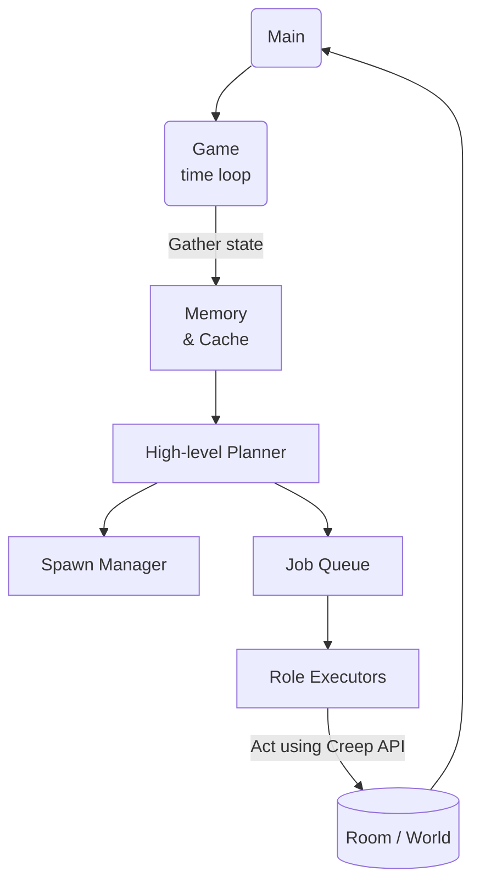

# Screeps Kingdom AI

Welcome to **Screeps Kingdom AI** – a fresh codebase focused on building a scalable, maintainable and competitive empire in the MMO programming game [Screeps](https://screeps.com/).

> "If we want machines to think, we need to teach them to survive."
>
> — **Screeps Philosophy**

---

## Table of Contents

1. Vision & Goals
2. High-Level Strategy
3. Technical Architecture
4. Development Workflow
5. Getting Started
6. Roadmap
7. References

---

## 1. Vision & Goals

Our objective is to create an autonomous AI that:

* **Grows steadily** from a single room to a multi-shard kingdom.
* **Adapts** its economy, expansion and military tactics to changing game states.
* **Self-maintains** through clean, modular code supported by tests and continuous integration.
* **Learns** from in-game metrics and evolves its strategies over time.

---

## 2. High-Level Strategy

The AI follows a staged approach inspired by proven Screeps patterns and the official [Screeps API](https://docs.screeps.com/api/):

| Phase | Focus | Key Milestones |
|-------|-------|---------------|
| **Bootstrapping** | Establish a sustainable energy economy at RCL 2-3. | • Harvest & store ≥ 300 energy/tick<br>• Keep **Spawn** energy ≥ 200 at all times |
| **Growth** | Rapid Room Controller upgrading & infrastructure build-out. | • Maintain ≤ 5 ticks downtime on `StructureSpawn.spawnCreep`<br>• Complete extensions, roads, defensive walls |
| **Multi-room** | Claim adjacent rooms and balance logistics. | • Automated remote mining<br>• Reserve/claim at cost ≤ 1 CPU/tick per room |
| **Defense & PvP** | Harden borders then project power. | • Tower automation & rampart layout<br>• Adaptive combat creep compositions |
| **Market & Power** | Optimize credits, pixels, GPL. | • Arbitrage orders ≥ 5% margin<br>• Enable `PowerSpawn` & power harvesting |

> NOTE: Exact thresholds are iterated via telemetry once we reach each stage.

---

## 3. Technical Architecture



Key modules:

* **Role Executors** – Small, single-responsibility classes implementing individual creep behaviors (e.g., Harvester, Builder, Defender). Their core method is `run(creep: Creep)`.
* **Spawn Manager** – Centralizes `StructureSpawn.spawnCreep(body, name, opts)` decisions based on current demand, energy and `Game.spawns` status.
* **Planner** – Global brain that evaluates metrics (GCL, energy flow, threats) and assigns high-level intents each tick.
* **Memory Schema** – `Memory` typings stored under `src/types.d.ts` for IntelliSense & compile-time safety.

Coding standards:

* TypeScript strict mode (`"strict": true` in `tsconfig.json`).
* ESLint + Prettier to enforce style and catch errors early.
* Unit tests with Jest for deterministic logic (pathfinding, body selection, planners).

---

## 4. Development Workflow

This project follows a **standard GitHub flow**: feature branches ➜ pull requests ➜ continuous integration ➜ merge.

1. **Fork & Clone** – Fork the repository on GitHub and `git clone` your fork locally.
2. **Create a Branch** – `git checkout -b feature/awesome-change`.
3. **Code & Test** – Implement your changes and run Jest unit tests.
4. **Simulate** – Spin up the local Screeps server (`npm run sim`) to verify behaviour in-game.
5. **Lint & Build** – `npm run lint && npm run build` to ensure the bundle compiles and style rules pass.
6. **Push & Open a PR** – `git push -u origin feature/awesome-change` then open a pull request on GitHub.
7. **CI & Review** – Wait for GitHub Actions to pass, request review, and merge into `main` once approved.
8. **Deploy to Screeps** – After merging, run `npm run push` (or `grunt screeps`) to upload the compiled `dist/*.js` to the configured Screeps branch using your auth token. See the [official docs](https://docs.screeps.com/commit.html) for details.

Project scripts (defined in `package.json`):

* `build` – Compile TypeScript with tsc and bundle with webpack.
* `sim` – Spin up a local Screeps server for fast iterations.
* `lint` – ESLint + Prettier.
* `test` – Jest unit tests.

---

## 5. Getting Started

```bash
# 0. Fork & clone the repository
git clone https://github.com/<your-username>/screeps-kingdom-ai.git
cd screeps-kingdom-ai

# 1. Install dependencies
npm install

# 2. Configure your screeps credentials
cp .env.example .env   # fill in email, token, branch

# 3. Initialize and launch a local simulation (optional)
npm run sim:init   # only the first time to create config
npm run sim        # start the server with Steam auth

# 4. Build your bundle (local use only)
npm run build

# 5. Upload the bundle to Screeps (online shard)
npm run push   # uses SCREEPS_TOKEN & SCREEPS_BRANCH from .env
```

---

## 6. Roadmap

- [ ] **MVP Roles** – Harvester, Upgrader, Builder.
- [ ] **Dynamic Body Generator** – Cost-effective body selection based on room energy.
- [ ] **Pathfinder Cache** – Global route cache with invalidation on construction changes.
- [ ] **Room Planner** – Automated layout blueprints (extensions, roads, labs) per controller level.
- [ ] **Remote Mining** – Automated scouting and resource extraction in neighboring rooms.
- [ ] **Defense AI** – Tower target prioritization, adaptive wall repair.
- [ ] **Market Bot** – Credit optimization using `Game.market` & statistical arbitrage.

---

## 7. References

* Official API – https://docs.screeps.com/api/
* Screeps Slack & Discord community.
* Community articles on roles, room layouts and performance.
* Open source AIs for inspiration (Thmsndk's SemperRabbit, bonzaiferroni/Kammy, ags131/Screeps-AI-wd).

---

Happy coding and may your creeps never recycle themselves! 🚀 